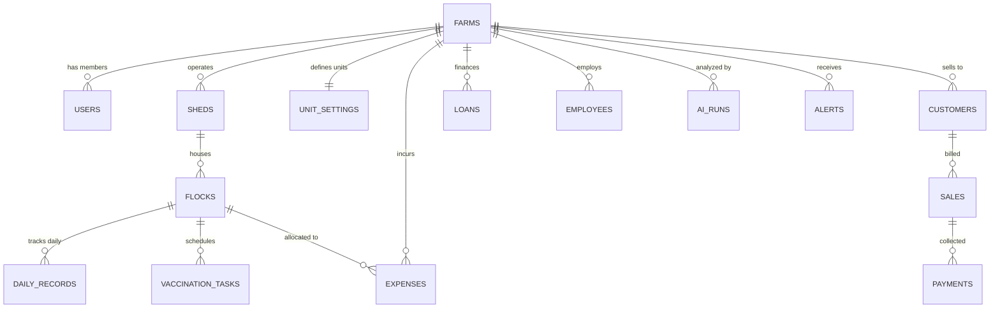

# LayerOS 🥚

### AI-Powered Layer Poultry & Egg Business Management Web App (Maharashtra, India)

[](https://nextjs.org/)
[](https://react.dev/)
[](https://www.typescriptlang.org/)
[](https://tailwindcss.com/)
[](https://vitest.dev/)
[](#)

> **"Every egg counted. Profit maximised."**  
> LayerOS is a mobile-first, installable Progressive Web Application (PWA) designed specifically for commercial layer farm owners (~30,000+ birds) in Maharashtra, India. It enables farm supervisors to log a day in **30 seconds** (Quick Mode) or **2 minutes** (Full Mode), and delivers AI-driven daily advice, multi-unit egg trade conversion, and 30-day profit/loss forecasting.

---

## 1. Reference Day Benchmark (Unit-Tested Fixture)

The calculation engine (`/lib/calc`) is strictly verified against the following reference standard:

| Metric                            | Reference Value      | Mathematical Formula                                                           |
| :-------------------------------- | :------------------- | :----------------------------------------------------------------------------- |
| **Active Live Birds**             | **30,000 birds**     | Opening (30,000) − Mortality (15) = 29,985                                     |
| **Eggs Collected**                | **27,300 eggs**      | Morning (17,200) + Evening (10,100)                                            |
| **Hen-Day (HD%)**                 | **91.0%**            | $\frac{\text{Eggs Collected}}{\text{Average Live Birds}} \times 100 = 91.02\%$ |
| **Feed Used**                     | **3,300 kg**         | 66 bags × 50 kg                                                                |
| **Feed Intake**                   | **110 g / bird**     | $\frac{3,300\text{ kg} \times 1000}{29,985\text{ birds}} = 110.05\text{ g}$    |
| **Mortality**                     | **15 birds (0.05%)** | $\frac{15}{30,000} \times 100 = 0.05\%$                                        |
| **Egg Sales**                     | **₹1,47,420**        | 27,300 eggs × ₹5.40/egg (= ₹540/100 eggs)                                      |
| **Feed Cost**                     | **₹1,15,500**        | 3,300 kg × ₹35.00/kg                                                           |
| **Other Cash Expenses**           | **₹12,000**          | Labour, medicine, diesel, electricity                                          |
| **Simple Operating Profit**       | **₹19,920**          | ₹1,47,420 − ₹1,15,500 − ₹12,000                                                |
| **Operating Cost per Egg**        | **₹4.67**            | $\frac{₹1,15,500 + ₹12,000}{27,300\text{ eggs}} \approx ₹4.67$                 |
| **Allocated Overheads**           | **₹14,600**          | Pullet amortisation, shed depreciation, loan EMI interest, salaries            |
| **True Profit (After Overheads)** | **₹5,320**           | Simple Profit (₹19,920) − Overheads (₹14,600)                                  |
| **Break-Even Egg Price**          | **₹5.21 / egg**      | ₹521 per 100 eggs                                                              |

---

## 2. Where LayerOS Wins

1. **Marathi-First, Farmer-Simple UX**: Authentic Devanagari terminology (मृत्यू, अंडी उत्पादन, खुराक, विक्री, उधारी/थकबाकी, नफा/तोटा, बंद दिवस) with large 48px+ touch targets.
2. **30-Second Quick Entry & 2-Minute Full Entry**: 4 required inputs on a single mobile screen; all other metrics derived deterministically.
3. **Operating Profit vs. True Profit**: Separates cash-in-hand operating profit from true economic profit (accounting for bird depreciation, pullet amortisation over 14 months, mortality book-value loss, and EMI interest).
4. **Always-Visible Break-Even Status**: Answers in 3 seconds: _Am I making or losing money today?_ Traffic-light indicators compare selling price with break-even threshold and published mandi rates.
5. **Configurable Regional Units**: Never hardcodes pack sizes. Owners define what a _gatta/peti/case_ means locally (e.g. 7 trays = 210 eggs in Pune/Western Maharashtra; 6 trays = 180 eggs; or 12 trays = 360 eggs).
6. **AI Daily Advisor & 30-Day Forecast**: Explains tomorrow's top 3 actions in plain language, calculates exact feed requirements, and provides interactive _What-If_ sliders with instant recomputation.
7. **Hold vs. Sell Mandi Indicator**: Compares today's rate against 7/14/30-day moving averages across 5 mandis (Pune, Mumbai, Nashik, Nagpur, Namakkal).
8. **Sandbox "Try Demo" Mode**: Instant access with 90 days of realistic history for _Sahyadri Layer Farm_ without signing up.

---

## 3. Technology Stack

- **Frontend**: Next.js 16 (App Router with Turbopack), React 19, TypeScript, Tailwind CSS v4, Lucide Icons, Recharts, Canvas Confetti.
- **PWA & Offline**: Web App Manifest (`/public/manifest.json`), IndexedDB / LocalStorage queue with last-write-wins conflict resolution.
- **Testing**: Vitest unit test suite verifying mathematical formulas and reference day assertions.
- **Backend / Database**: PostgreSQL schema with Row Level Security (RLS) across 32 multi-tenant tables (`/supabase/migrations/001_init_schema.sql`).
- **AI Service**: Provider-agnostic service (`/lib/ai`) supporting Gemini API and fallback rule-based analytical engine.
- **i18n**: Marathi (`mr`, default), English (`en`), and Hindi (`hi`).

---

## 4. Entity-Relationship (ER) Diagram



---

## 5. Design System

- **Primary Deep Forest Green**: `#1F4D3A` (hover `#173A2C`)
- **Accent Egg-Gold**: `#D9A441` (hover `#C69234`)
- **Background Warm Ivory**: `#FAF8F3`, surface `#FFFFFF`, border `#E7E2D6`
- **Text Ink**: `#1B2A24`, muted `#6B7A72`
- **Status Colors**: Success `#2E7D5B`, warning `#D98E04`, danger `#B3382C`, info `#2F6F9F`
- **Dark Mode**: Background `#0F1A15`, surface `#16241D`, border `#263B30`
- **Typography**: Inter + Noto Sans Devanagari; tabular numerals for KPIs; minimum 48px touch targets.
- **Number Formats**: Indian currency ₹ with Lakh/Crore grouping (`₹1,47,420`).

---

## 6. Roles & Permissions

| Role                       | Access Permissions                                                                  |
| :------------------------- | :---------------------------------------------------------------------------------- |
| **Owner (मालक)**           | Everything: all financial reports, AI forecasts, settings, user permissions         |
| **Manager (व्यवस्थापक)**   | Operational approvals, records, daily closing, reports; restricted billing settings |
| **Supervisor (सुपरवायझर)** | Quick Log, Full Daily Entry, egg collection, mortality logging, feed issues         |
| **Accountant (हिशोबनीस)**  | Sales challans, customer ledgers, payment receipts, expenses, payroll               |
| **Viewer (तपासनीस)**       | Read-only access to selected health and production reports for consulting vets      |

---

## 7. Setup & Local Development

### Prerequisites

- Node.js v18+ (tested on Node v24.x)
- npm v9+

### Installation Steps

```bash
# 1. Clone repository
git clone https://github.com/your-username/layer-os.git
cd layer-os

# 2. Install dependencies
npm install

# 3. Run Calculation Engine Unit Tests
npm test

# 4. Start Development Server
npm run dev

# Open http://localhost:3000 in your browser
```

---

## 8. Deployment Guide

### Deploy to Vercel

1. Push your repository to GitHub.
2. In Vercel, click **"Add New Project"** and select `layer-os`.
3. Set the Framework Preset to **Next.js**.
4. Configure optional environment variables:
   - `GEMINI_API_KEY`: Your Google Gemini API key.
   - `NEXT_PUBLIC_SUPABASE_URL`: Supabase project URL.
   - `NEXT_PUBLIC_SUPABASE_ANON_KEY`: Supabase anon key.
5. Click **Deploy**.

### Connect to Supabase PostgreSQL

1. Create a new Supabase project at [supabase.com](https://supabase.com).
2. Open the **SQL Editor** in Supabase.
3. Paste the contents of `supabase/migrations/001_init_schema.sql` and click **Run**.
4. Add the connection keys to `.env.local`.

---

## 9. Regulatory & Legal Disclaimers

- **GST Treatment**: In India, fresh table eggs are generally exempt from GST under Notification No. 2/2017-Central Tax (Rate). Always confirm with your chartered accountant.
- **Digital Personal Data Protection (DPDP) Act**: No personal employee or customer data is transmitted to AI services; all numbers sent to LLM models are aggregated and anonymized.
- **Veterinary & Financial Disclaimer**: LayerOS AI suggestions are decision support tools and do not constitute certified veterinary medical prescriptions or financial guarantees.

made by rohan and onkar
